# Домашнее задание по лекции "Couchbase"

## Задание

Необходимо:
- Развернуть кластер Couchbase.
- Создать БД, наполнить небольшими тестовыми данными.
- Проверить отказоустойчивость.

## Выполнение задания:

### Установка MongoDB:

1. Создаю три ВМ в конфигурации: 2 ядра процессора, 2 Гб памяти, 15 Гб жесткий диск, ОС CentOS 7.9

2. Устанавливаю JRE.

3. Подключаю репозиторий Couchbase:
```
curl -O https://packages.couchbase.com/releases/couchbase-release/couchbase-release-1.0.noarch.rpm
yum install ./couchbase-release-1.0.noarch.rpm
```

4. Устанавливаю Couchbase:
```
yum install couchbase-server-community
```


### Создание кластера

1. Захожу на первый сервер по адресу http://192.168.1.21:8091

2. Нажимаю "Setup New Cluster":

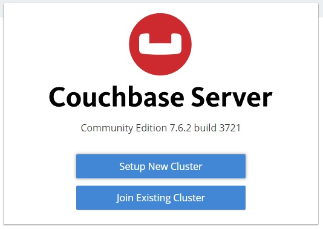

3. Ввожу название кластера, имя пользователя-администратора и его пароль:

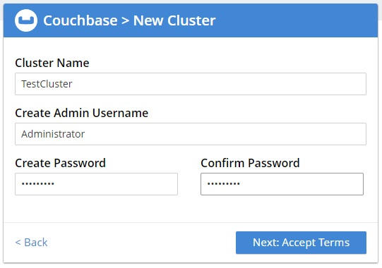

4. Соглашаюсь с пользовательским соглашением и нажимаю "Configure Disk, Memory, Services":

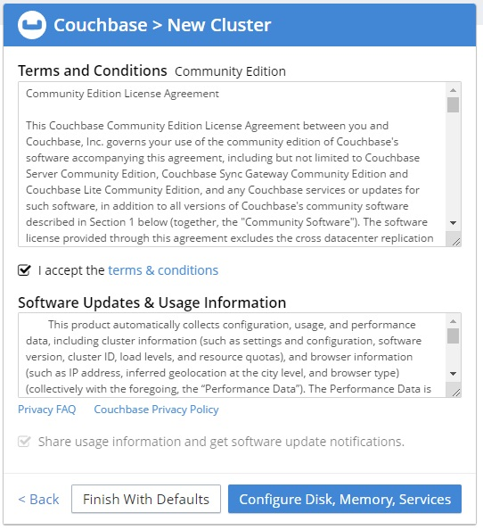

5. Ввожу только IP-адрес первого сревера (остальные параметры оставляю по умолчанию) и нажимаю "Save & Finish":

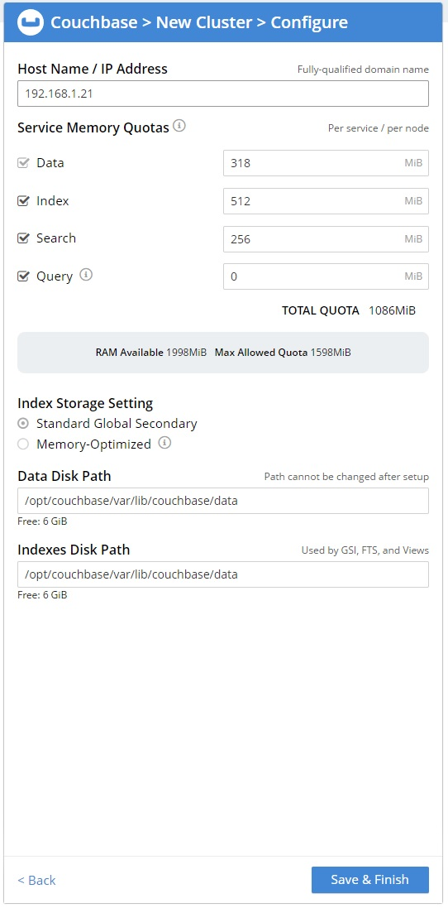

6. В списке серверов появляется первый сервер. Добавляю следующий сервер, нажав "Add Server":

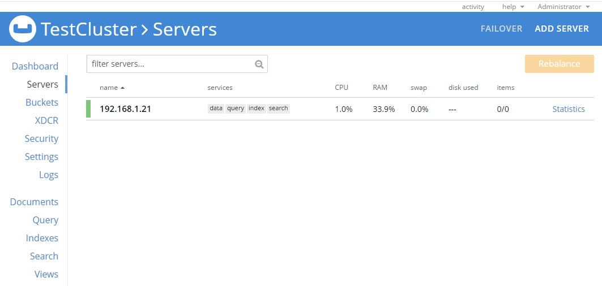

7. Ввожу IP-адрес второго сервера и логин/пароль ранее созданного администратора, и нажимаю "Add Server":


8. Второй сервер добавлен, но требуется перебалнисровка, для чего нажимаю "Rebalance":

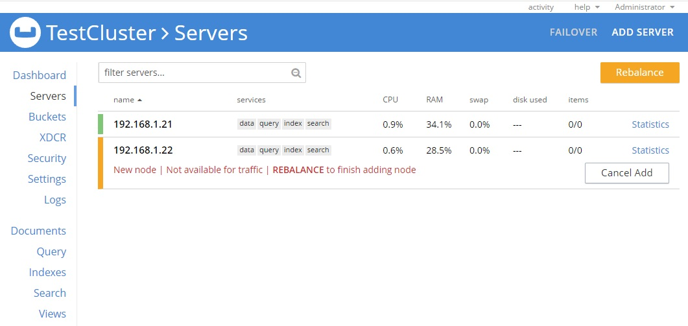

9. Новый сервер добавлен и готов к работе:

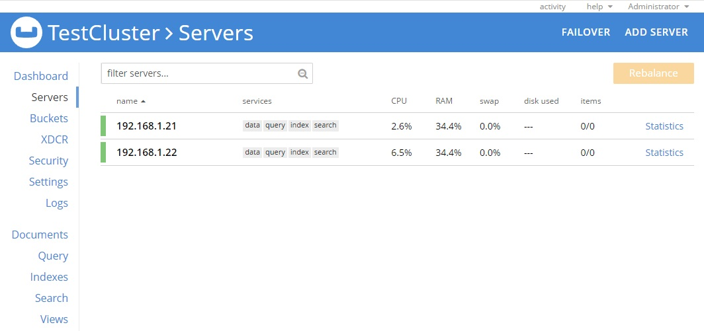

10. Таким же образом добавляю третий сервер и ребалансирую кластер. Кластер готов к работе:

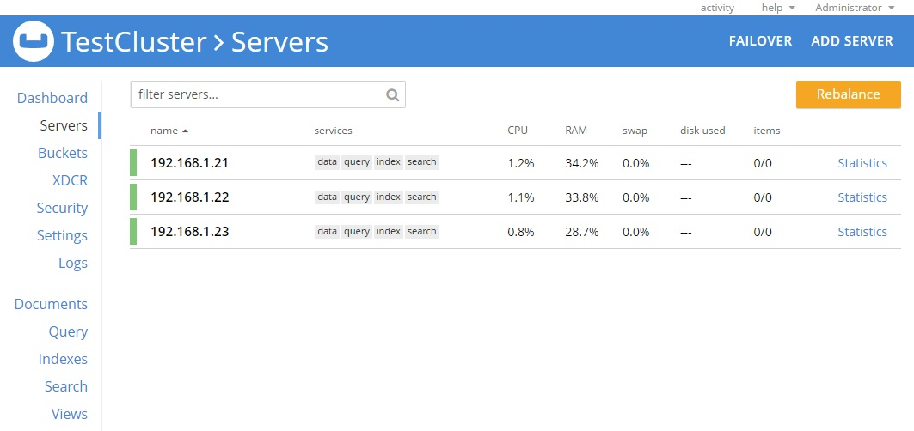


### Создание Bucket, Scope и Collection

1. Перехожу в закладку "Buckets" и нажимаю "Add Bucket":

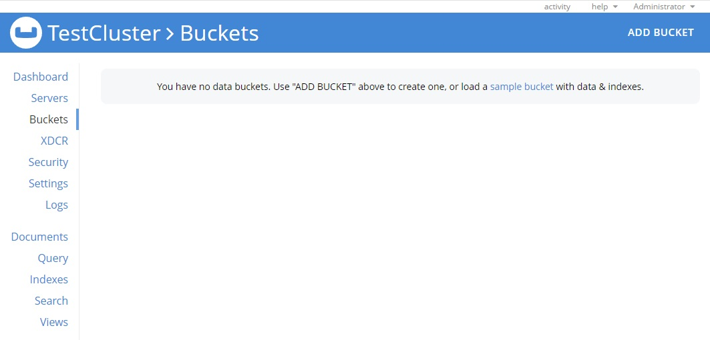

2. Ввожу имя test, выбираю количество реплик 2 (остальные параметры оставляю по умолчанию), и нажимаю "Add Bucket":

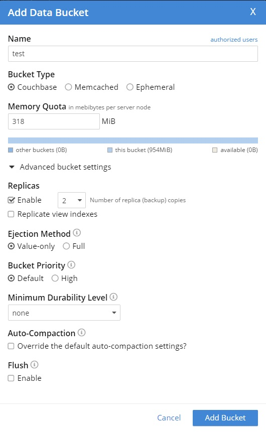

3. Bucket test создан. Нажимаю в нём "Scopes & Collections":

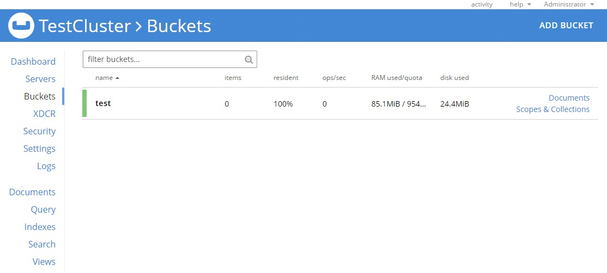

4. Создаю scope, нажав "Add Scope":

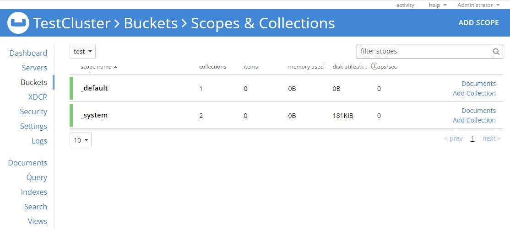

5. Выбираю bucket, ввожу название scope, и создаю его, нажав "Save":

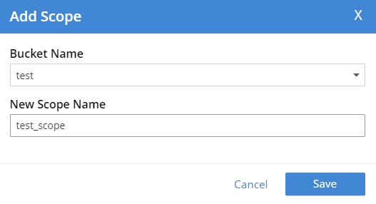

6. Новый scope создан. Нажимаю "Add Collection" в нём:

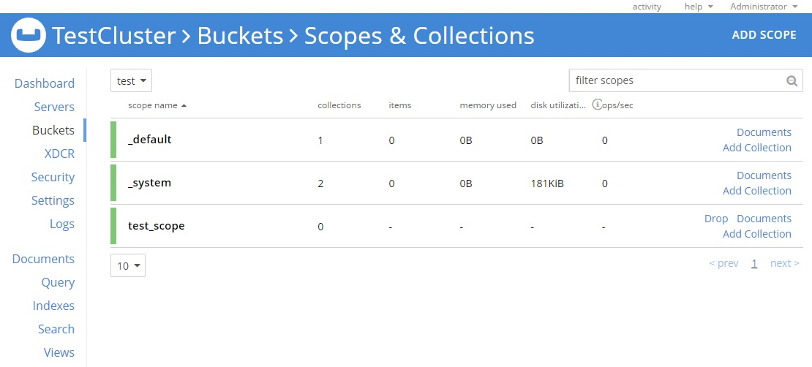

7. Задаю имя коллекции и нажимаю "Save":

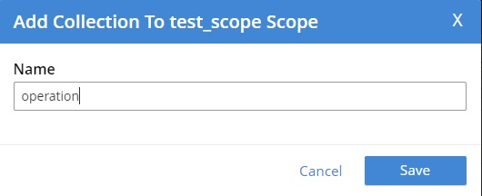

8. Коллекция operation добавлена:

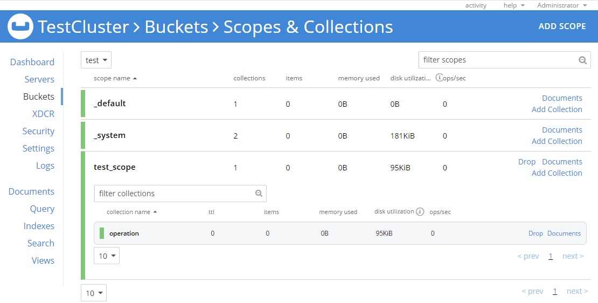


### Наполнение коллекции данными

В коллекции opaeration будут приходы/расходы денежных средств со следующими полями:
* operID - ID операции
* date - дата операции
* name - имя и фамилия
* operation - приход/расход денежных средств (положительное число - приход, отрицательное - расход)

1. Создаю нижеследующий скрипт (bash linux), генерирующий данные в json-файл для загрузки в БД:
```
#!/bin/sh

NAMES=("Иван Иванов" "Пётр Петров" "Сидор Сидоров")  # массив с именами и фамилиями

for (( i=1; i <= 100000; i++ ))  # цикл с 100000 повторений
do
     NM=`tr -dc 0-2 </dev/urandom | head -c 1`  # генерация слуйчайного идентификатора в массиве имён и фамилий
     DT=`date +"%F %H:%M:00" --date="$i minutes ago"`  # генерация даты мотодом вычитания из текущей даты/времени минут, равных счётчику цикла
     OPER=`tr -dc 1-9 </dev/urandom | head -c 4`  # генерация случаной суммы операции
     OPER_1=`tr -dc 1-2 </dev/urandom | head -c 1`  # генерация знака операции (1 - положительный, 2 - отрицательный)
     if [[ $OPER_1 == "2" ]]  # добавление знака минус в операцию, в случае сгенерированного отрицательного знака
     then
             OPER="-$OPER"
     fi
     echo { \"operID\": \"$i\", \"date\": \"$DT\", \"\name\": \"${NAMES[$NM]}\", \"operation\": { \"\$numberInt\": \"$OPER\"} } >> /root/operation.json  # запись строки данных в json-файл
done
```

2. Загружаю данные из сгенерированного json-файла в коллекцию operation командой:
```
[root@lab1 ~]# /opt/couchbase/bin/cbimport json -c couchbase://192.168.1.21 -u Administrator -p -b test -f lines -d file:///root/operation.json --scope-collection-exp test_scope.operation -g key::%operID%::#MONO_INCR#
Password for -p:
JSON `/root/operation.json` imported to `couchbase://192.168.1.21` successfully
Documents imported: 100000 Documents failed: 0
```

3. Данные появились в коллекции operation:

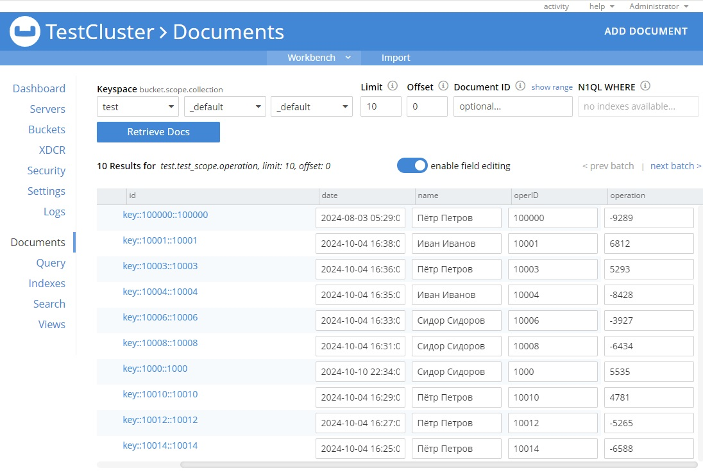


### Проверка отказоустойчивости

1. Останавливаю сервис couchbase на третьем узле:
```
systemctl stop couchbase-server
```

2. Сервер в кластере становится недоступным. Нажимаю "Failover":

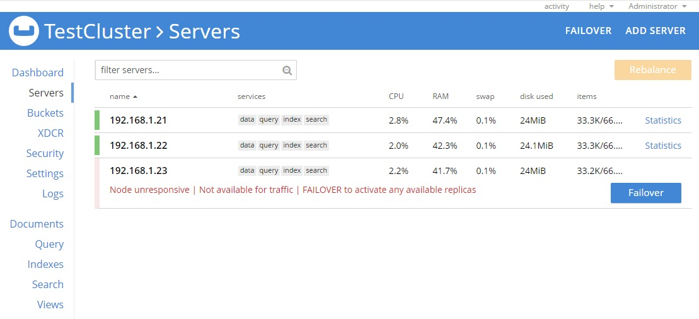

3. Подтверждаю вывод сбойного сервера из кдастера:

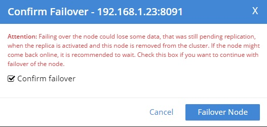

4. Нажимаю "Rebalance" для завершения процесса:

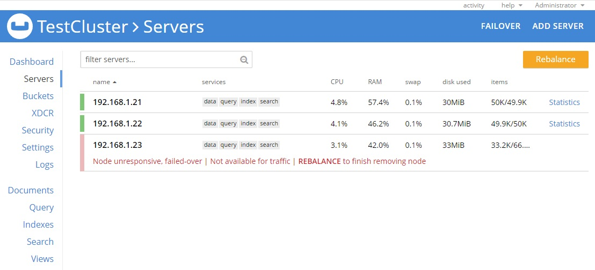

5. Сбойный сервер выведен из калстера:

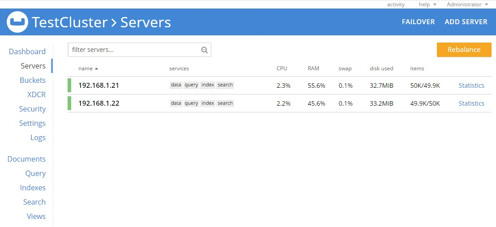

6. Проверяю, что все данные доступны (100000 загруженных строк считаются count-ом):

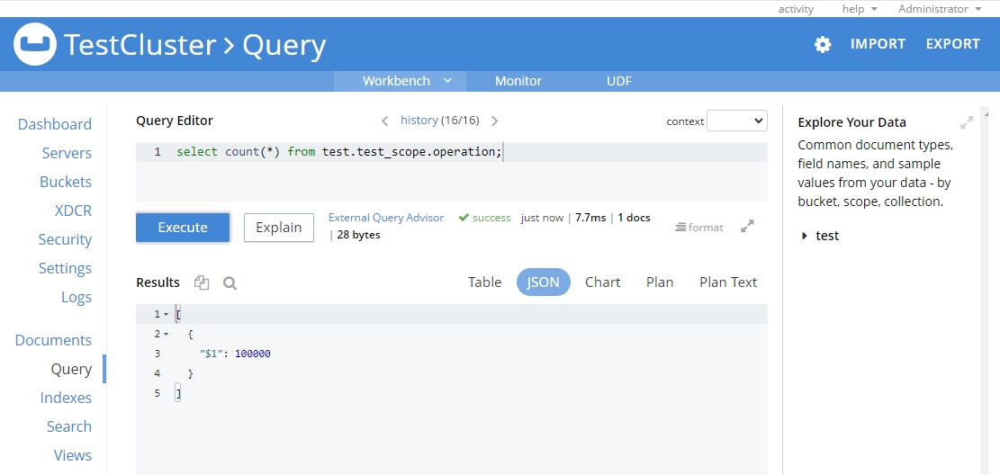

7. Запускаю на третьем узле сервис couchbase-server и добавляю сервер в кластер:

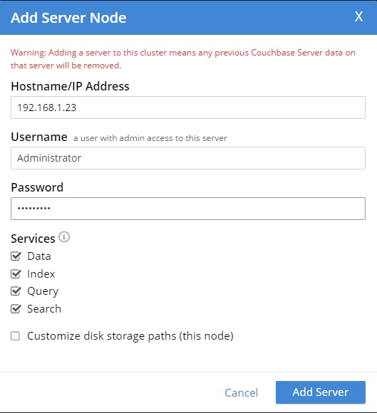

8. Сервер добавлен, но требудется ребалансировка, для чего нажимю "Rebalance":

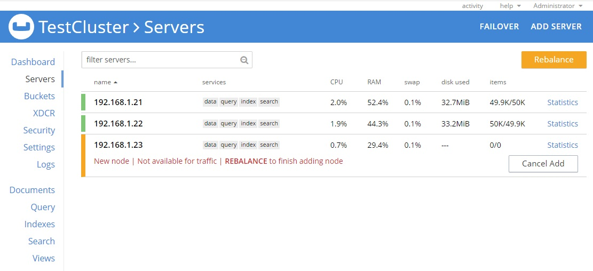

9. Сервер добавлен и находится в рабочем состоянии:

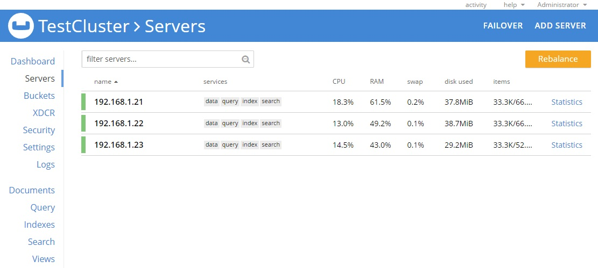

10. Проверяю доспность данных запросом:

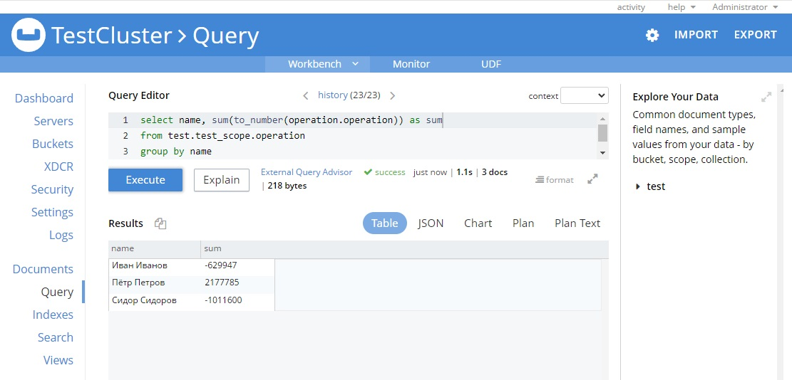
