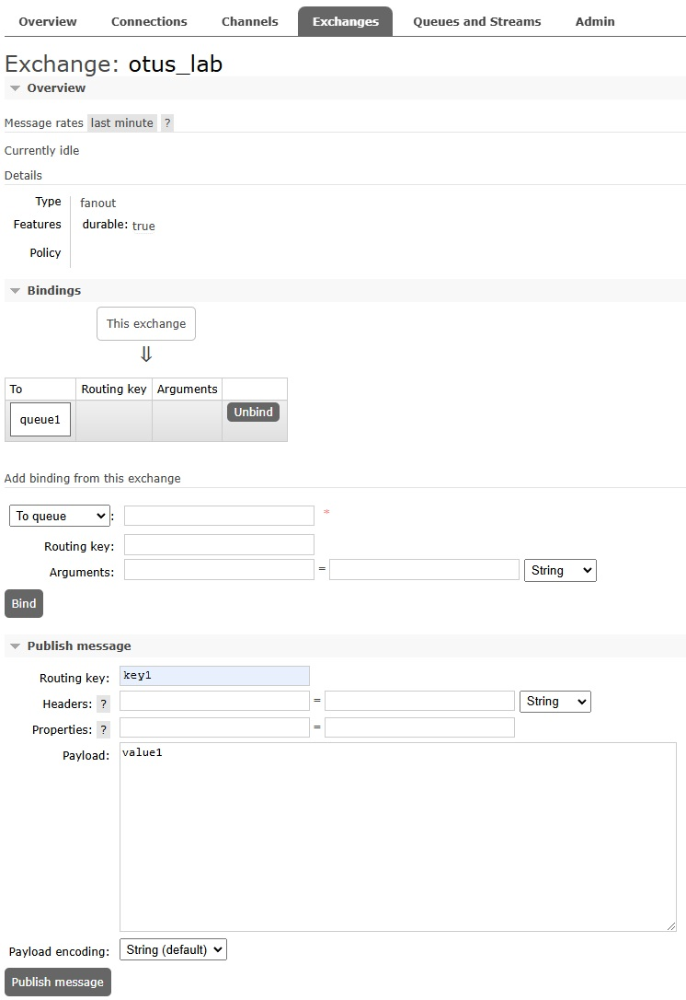

# Домашнее задание по лекции "RabbitMQ"

## Задание

1. Запустите RabbitMQ (можно в docker)
2. Отправьте несколько тем для сообщений через web UI
3. Прочитайте их, используя web UI в браузере
4. Отправьте и прочитайте сообщения программно - выберите знакомый язык программирования (C#, Java, Go, Python или любой другой, для которого есть библиотека для работы с RabbitMQ), отправьте и прочитайте несколько сообщений

Для пунктов 2 и 3 сделайте скриншоты отправки и получения сообщений.

Для пункта 4 приложите ссылку на репозитарий на гитхабе с исходным кодом.

## Выполнение задания

### Установка RabbitMQ на ВМ

1. Импортирую ключи:
```
rpm --import 'https://github.com/rabbitmq/signing-keys/releases/download/3.0/rabbitmq-release-signing-key.asc'
rpm --import 'https://github.com/rabbitmq/signing-keys/releases/download/3.0/cloudsmith.rabbitmq-erlang.E495BB49CC4BBE5B.key'
rpm --import 'https://github.com/rabbitmq/signing-keys/releases/download/3.0/cloudsmith.rabbitmq-server.9F4587F226208342.key'
```

2. Прописываю репозитории в файле /etc/yum.repos.d/rabbitmq.repo со следующим содержимым:
```
##
## Zero dependency Erlang RPM
##

[modern-erlang]
name=modern-erlang-el8
# Use a set of mirrors maintained by the RabbitMQ core team.
# The mirrors have significantly higher bandwidth quotas.
baseurl=https://yum1.rabbitmq.com/erlang/el/8/$basearch
        https://yum2.rabbitmq.com/erlang/el/8/$basearch
repo_gpgcheck=1
enabled=1
gpgkey=https://github.com/rabbitmq/signing-keys/releases/download/3.0/cloudsmith.rabbitmq-erlang.E495BB49CC4BBE5B.key
gpgcheck=1
sslverify=1
sslcacert=/etc/pki/tls/certs/ca-bundle.crt
metadata_expire=300
pkg_gpgcheck=1
autorefresh=1
type=rpm-md

[modern-erlang-noarch]
name=modern-erlang-el8-noarch
# Use a set of mirrors maintained by the RabbitMQ core team.
# The mirrors have significantly higher bandwidth quotas.
baseurl=https://yum1.rabbitmq.com/erlang/el/8/noarch
        https://yum2.rabbitmq.com/erlang/el/8/noarch
repo_gpgcheck=1
enabled=1
gpgkey=https://github.com/rabbitmq/signing-keys/releases/download/3.0/cloudsmith.rabbitmq-erlang.E495BB49CC4BBE5B.key
       https://github.com/rabbitmq/signing-keys/releases/download/3.0/rabbitmq-release-signing-key.asc
gpgcheck=1
sslverify=1
sslcacert=/etc/pki/tls/certs/ca-bundle.crt
metadata_expire=300
pkg_gpgcheck=1
autorefresh=1
type=rpm-md

[modern-erlang-source]
name=modern-erlang-el8-source
# Use a set of mirrors maintained by the RabbitMQ core team.
# The mirrors have significantly higher bandwidth quotas.
baseurl=https://yum1.rabbitmq.com/erlang/el/8/SRPMS
        https://yum2.rabbitmq.com/erlang/el/8/SRPMS
repo_gpgcheck=1
enabled=1
gpgkey=https://github.com/rabbitmq/signing-keys/releases/download/3.0/cloudsmith.rabbitmq-erlang.E495BB49CC4BBE5B.key
       https://github.com/rabbitmq/signing-keys/releases/download/3.0/rabbitmq-release-signing-key.asc
gpgcheck=1
sslverify=1
sslcacert=/etc/pki/tls/certs/ca-bundle.crt
metadata_expire=300
pkg_gpgcheck=1
autorefresh=1


##
## RabbitMQ Server
##

[rabbitmq-el8]
name=rabbitmq-el8
baseurl=https://yum2.rabbitmq.com/rabbitmq/el/8/$basearch
        https://yum1.rabbitmq.com/rabbitmq/el/8/$basearch
repo_gpgcheck=1
enabled=1
# Cloudsmith's repository key and RabbitMQ package signing key
gpgkey=https://github.com/rabbitmq/signing-keys/releases/download/3.0/cloudsmith.rabbitmq-server.9F4587F226208342.key
       https://github.com/rabbitmq/signing-keys/releases/download/3.0/rabbitmq-release-signing-key.asc
gpgcheck=1
sslverify=1
sslcacert=/etc/pki/tls/certs/ca-bundle.crt
metadata_expire=300
pkg_gpgcheck=1
autorefresh=1
type=rpm-md

[rabbitmq-el8-noarch]
name=rabbitmq-el8-noarch
baseurl=https://yum2.rabbitmq.com/rabbitmq/el/8/noarch
        https://yum1.rabbitmq.com/rabbitmq/el/8/noarch
repo_gpgcheck=1
enabled=1
# Cloudsmith's repository key and RabbitMQ package signing key
gpgkey=https://github.com/rabbitmq/signing-keys/releases/download/3.0/cloudsmith.rabbitmq-server.9F4587F226208342.key
       https://github.com/rabbitmq/signing-keys/releases/download/3.0/rabbitmq-release-signing-key.asc
gpgcheck=1
sslverify=1
sslcacert=/etc/pki/tls/certs/ca-bundle.crt
metadata_expire=300
pkg_gpgcheck=1
autorefresh=1
type=rpm-md

[rabbitmq-el8-source]
name=rabbitmq-el8-source
baseurl=https://yum2.rabbitmq.com/rabbitmq/el/8/SRPMS
        https://yum1.rabbitmq.com/rabbitmq/el/8/SRPMS
repo_gpgcheck=1
enabled=1
gpgkey=https://github.com/rabbitmq/signing-keys/releases/download/3.0/cloudsmith.rabbitmq-server.9F4587F226208342.key
gpgcheck=0
sslverify=1
sslcacert=/etc/pki/tls/certs/ca-bundle.crt
metadata_expire=300
pkg_gpgcheck=1
autorefresh=1
type=rpm-md
```

3. Устанавливаю пакет socat:
```
yum install socat
```

4. Устанавливаю пакеты RabbitMQ и Erlang:
```
yum install erlang rabbitmq-server
```

5. Включаю автозапуск и запускаю сервис RabbitMQ:
```
systemctl enable rabbitmq-server
systemctl start rabbitmq-server
```

6. Включаю web-консоль RabbitMQ:
```
rabbitmq-plugins enable rabbitmq_management
```

7. Для работы в web-консоли, создаю в RabbitMQ пользователя с правами администратора:
```
rabbitmqctl add_user 'admin' 'admin12345'
rabbitmqctl set_user_tags 'admin' 'administrator'
rabbitmqctl set_permissions --vhost '/' 'admin' '.*' '.*' '.*'
```

### Добавление и получение данных через web-консоль

1. Создаю exchange с именем otus_lab и типом маршрутизации fanout:

<kbd></kbd>

Exchange создан:

<kbd></kbd>

2. Создаю очередь queue1:

<kbd></kbd>

Очередь создана:

<kbd></kbd>

3. Привязываю exchange к очереди:

<kbd></kbd>

Exchange привязан к очереди:

<kbd></kbd>

4. Публикую три сообщения в виде пары ключ/значение:
- key1 - value1
- key2 - value2
- key3 - value3

<kbd></kbd>

5. Получаю три опубликованных сообщения, помечая их полученными:

<kbd></kbd>

Сообщения успешно получены:

<kbd></kbd>

### Добавление и получение данных программно

Для работы с данными выбираю скрипты, написанные на Python.

Будут использоваться созданные ранее exchange и очередь.

1. Создаю скрипт отправки сообщений send.py со следующим содержимым:
```
import pika, sys

connection = pika.BlockingConnection(pika.ConnectionParameters(
               'localhost'))
channel = connection.channel()

channel.queue_declare(queue='queue1', durable=True)

routing_key = sys.argv[1]
body = sys.argv[2]

channel.basic_publish(exchange='otus_lab',
        routing_key=routing_key,
        body=body)

print(f"Sent {routing_key}: {body}")

connection.close()
```

2. Создаю скрипт получения сообщений receive.py со следующим содержимым:
```
import pika, time

connection = pika.BlockingConnection(pika.ConnectionParameters(
               'localhost'))
channel = connection.channel()

channel.queue_declare(queue='queue1', durable=True)

def callback(ch, method, properties, body):
    print(f"Received {method.routing_key}: {body.decode()}")
    time.sleep(body.count(b'.'))
    print("Done")

message = channel.basic_consume(queue='queue1', on_message_callback=callback, auto_ack=False)

channel.start_consuming()
```

3. Запускаю скрипт получения сообщений, ожидающий новые сообщения:
```
# python3 receive.py
```

4. Отправляю три сообщения в виде пары ключ/значение:
```
# python3 send.py key1 value1
Sent key1: value1
# python3 send.py key2 value2
Sent key2: value2
# python3 send.py key3 value3
Sent key3: value3
```

5. Отправленные сообщения получены скриптом:
```
# python3 receive.py
Received key1: value1
Done
Received key2: value2
Done
Received key3: value3
Done
```
