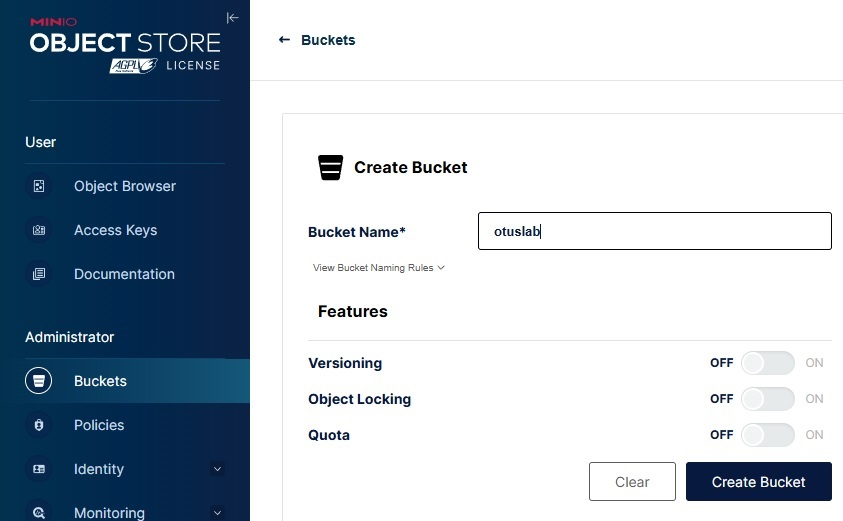
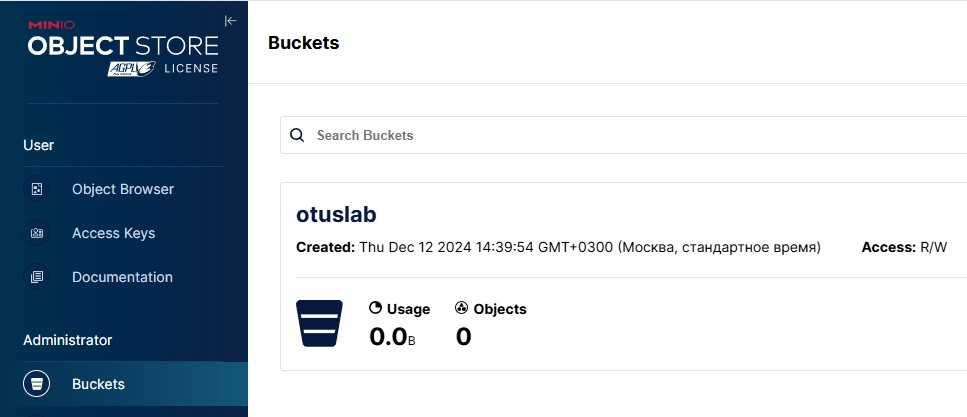
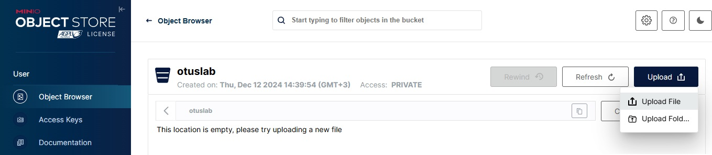
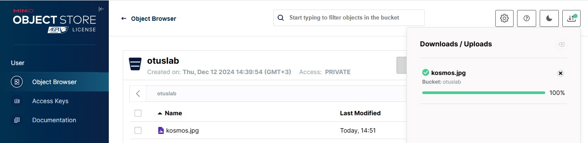
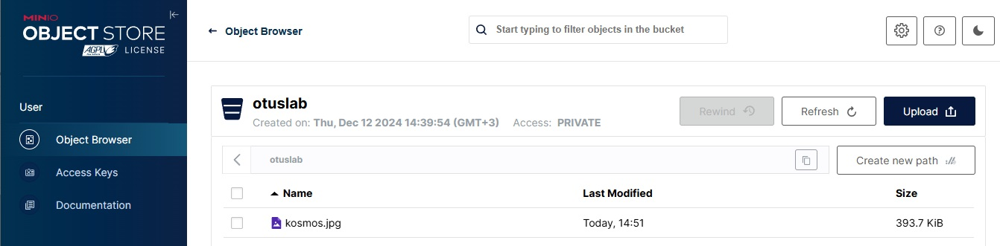
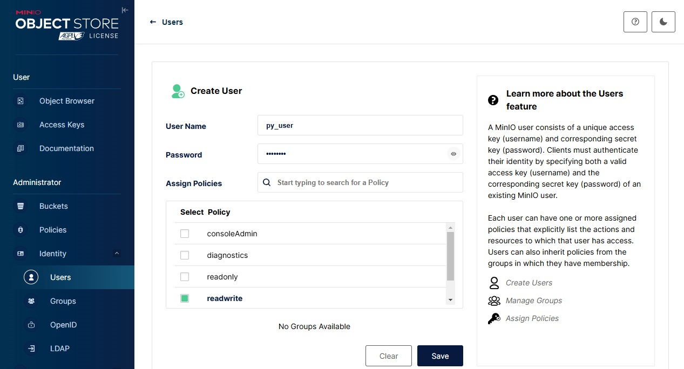
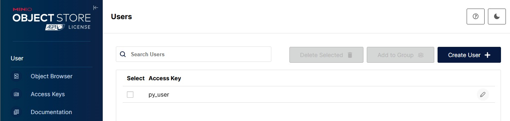
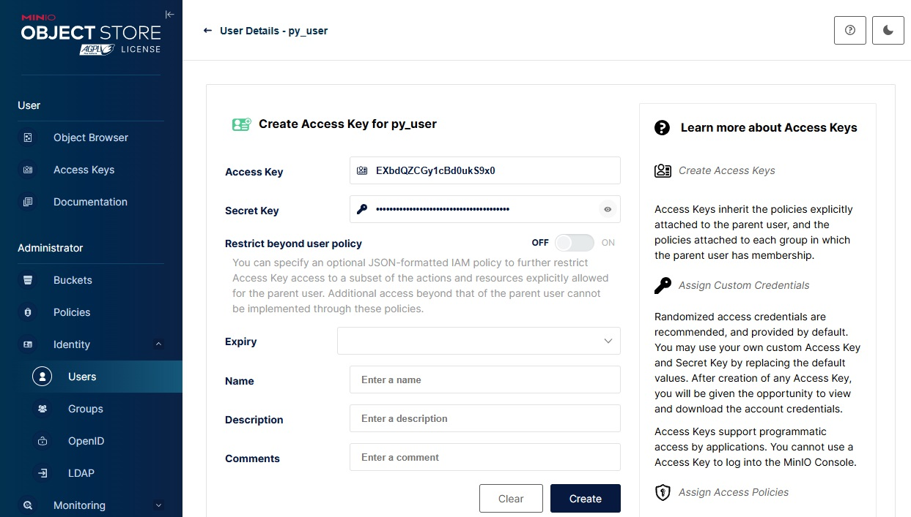
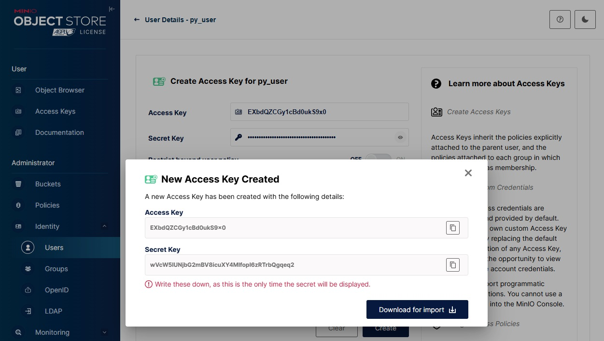
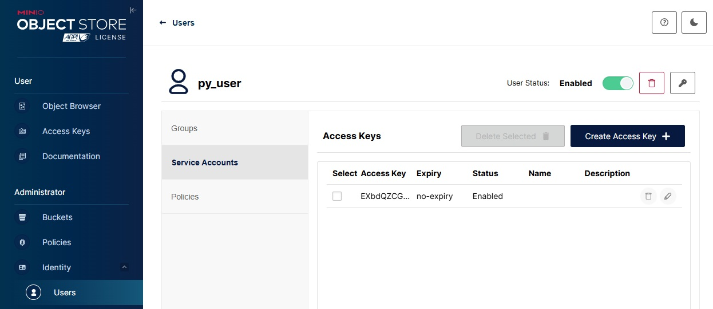

# Домашнее задание по лекции "S3"

## Задание

1. Запустить сервис S3 в облаке или локально (Docker + minio)
2. Создать бакет используя API
3. Сохранить файл в бакет используя API
4. Сохраните файл программно - выберите знакомый язык программирования (C#, Java, Go, Python или любой другой, для которого есть библиотека для работы с S3), отправьте файл в бакет и потом получите массив файлов из бакет и отобазите в бараузере или консоли.

Для пунктов 2 и 3 сделайте скриншоты результата выполнения.

Для пункта 4 приложите ссылку на репозитарий на гитхабе с исходным кодом.

## Выполнение задания

### Установка MinIO

1. Скачиваю и устанавливаю пакет MinIO:
```
wget https://dl.min.io/server/minio/release/linux-amd64/archive/minio-20241107005220.0.0-1.x86_64.rpm -O minio.rpm
yum install ./minio.rpm
```

2. Создаю директорию для данных MinIO:
```
mkdir /opt/minio_data
```

3. Создаю системного пользователя для запуска сервиса MinIO и даю ему права на директорию данных:
```
groupadd -r minio-user
useradd -M -r -g minio-user minio-user
chown minio-user: /opt/minio_data
```

4. В файле /etc/default/minio задаю переменные для MinIO:
```
MINIO_ROOT_USER=minioadmin
MINIO_ROOT_PASSWORD=*****
MINIO_VOLUMES="/opt/minio_data"
MINIO_OPTS="--console-address :9001"
```

5. Включаю автозапуск и запускаю сервис MinIO:
```
systemctl enable minio
systemctl start minio
```

### Работа с MinIO через консоль API

1. Захожу в консоль по адресу:
```
http://192.168.1.16:9001
```

2. Создаю bucket:

<kbd></kbd>

<kbd></kbd>

3. Закачиваю в созданный bucket файл:

<kbd></kbd>

<kbd></kbd>

<kbd></kbd>

4. Создаю пользователя для работы с данными:

<kbd></kbd>

<kbd></kbd>

5. Для созданного пользователя создаю Access key и Secret key:

<kbd></kbd>

<kbd></kbd>

<kbd></kbd>

### Работа с MinIO программно

