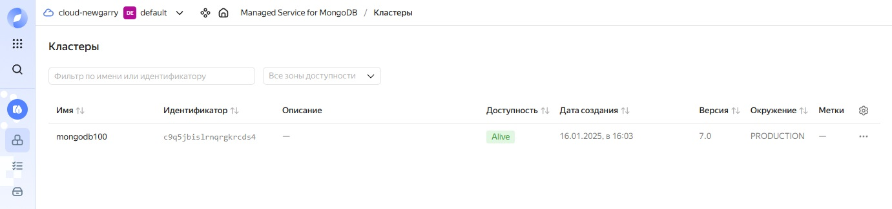
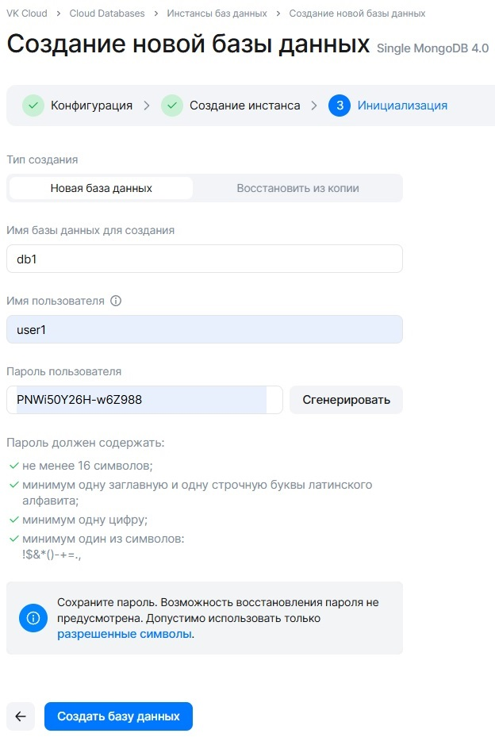

# Домашнее задание по лекции "Облака"

## Задание

Необходимо:
 - одну из облачных БД заполнить данными (любыми из предыдущих дз);
 - протестировать скорость запросов.

Задание повышенной сложности*
сравнить 2-3 облачных NoSQL по скорости загрузки данных и времени выполнения запросов.

## Выполнение задания

### Создание тестовых данных для загрузки в БД

Создаю JSON-файл с данными для тестовой коллекции operations прихода/расхода денежных средств со следующими полями:
* date - дата операции
* name - имя
* operation - приход/расход денежных средств (положительное число - приход, отрицательное - расход)

Генерирую данные следующим скриптом bash linux:

```
#!/bin/sh

   NAMES=("Ivan" "Petr" "Pavel" "Dmitry" "Aleksey" "Sergey" "Vladimir" "Victor" "Oleg" "Andrey")  # массив с именами

for (( i=1; i <= 1000000; i++ ))  # цикл с 1000000 повторений
do
     NM=`tr -dc 0-9 </dev/urandom | head -c 1`  # генерация слуйчайного идентификатора в массиве имён
     DT=`date +"%F %H:%M:00" --date="$i minutes ago"`  # генерация даты мотодом вычитания из текущей даты/времени минут, равных счётчику цикла
     OPER=`tr -dc 1-9 </dev/urandom | head -c 4`  # генерация случаной суммы операции
     OPER_1=`tr -dc 1-2 </dev/urandom | head -c 1`  # генерация знака операции (1 - положительный, 2 - отрицательный)
     if [[ $OPER_1 == "2" ]]  # добавление знака минус в операцию, в случае сгенерированного отрицательного знака
     then
             OPER="-$OPER"
     fi
     echo { \"date\": \"$DT\", \"\name\": \"${NAMES[$NM]}\", \"operation\": { \"\$numberInt\": \"$OPER\"} } >> 1.json  # запись строки данных в json-файл
done
```

### Создание БД в Yandex Cloud

1. Регистрируюсь в Yandex Cloud.

2. Создаю кластер MongoDB с внешним IP:

<kbd></kbd>

<kbd></kbd>

<kbd></kbd>

<kbd></kbd>

<kbd></kbd>

3. Добавляю в профиль безопасности внешний доступ к БД по порту 27018:

<kbd></kbd>

<kbd></kbd>

<kbd></kbd>

4. Копирую SSL-сертификат:

```
mkdir -p ~/.mongodb
wget "https://storage.yandexcloud.net/cloud-certs/CA.pem" --output-document ~/.mongodb/root.crt
chmod 0644 ~/.mongodb/root.crt
```

5. Проверяю, что есть подключение к созданной БД с клиента на моём рабочем месте:

```
[root@host ~]# mongosh --norc --tls --tlsCAFile ~/.mongodb/root.crt --host 'rc1d-2rwigtopclqpgwnn.mdb.yandexcloud.net:27018' --username user1 --password '*****' db1
Current Mongosh Log ID: 67890ac1915396a22b544ca6
Connecting to:          mongodb://<credentials>@rc1d-2rwigtopclqpgwnn.mdb.yandexcloud.net:27018/db1?directConnection=true&tls=true&tlsCAFile=%2Froot%2F.mongodb%2Froot.crt&appName=mongosh+2.3.8
Using MongoDB:          7.0.5-mdb-c5ca57f0-sgn
Using Mongosh:          2.3.8

For mongosh info see: https://www.mongodb.com/docs/mongodb-shell/


To help improve our products, anonymous usage data is collected and sent to MongoDB periodically (https://www.mongodb.com/legal/privacy-policy).
You can opt-out by running the disableTelemetry() command.

------
   The server generated these startup warnings when booting
   2025-01-16T13:10:28.264+00:00: Using the XFS filesystem is strongly recommended with the WiredTiger storage engine. See http://dochub.mongodb.org/core/prodnotes-filesystem
------
```


### Создание БД в VK Cloud

1. Регистрируюсь в VK Cloud

2. Создаю экземпляр БД с внешним IP:

<kbd></kbd>

<kbd></kbd>

<kbd></kbd>

<kbd></kbd>

<kbd></kbd>

3. Проверяю, что есть подключение к созданной БД с клиента на моём рабочем месте:

```
[root@rhel8 ~]# mongosh --host '212.233.95.154:27017' --username user1 --password '*****' db1
Current Mongosh Log ID: 678a282ac36cda1ef4544ca6
Connecting to:          mongodb://<credentials>@212.233.95.154:27017/db1?directConnection=true&appName=mongosh+2.3.8
Using MongoDB:          4.0.28
Using Mongosh:          2.3.8

For mongosh info see: https://www.mongodb.com/docs/mongodb-shell/
```

### Тестирование и сравнение скорости запросов в БД

1. Загружаю тестовые данные:

- в Yandex Cloud:

```
[root@host ~]# mongoimport --db=db1 --collection=operations --file=1.json --ssl --tlsInsecure --sslCAFile ~/.mongodb/root.crt --host 'rc1d-2rwigtopclqpgwnn.mdb.yandexcloud.net:27018' --username user1 --password '*****'
2025-01-17T10:58:33.924+0300    connected to: mongodb://rc1d-2rwigtopclqpgwnn.mdb.yandexcloud.net:27018/
2025-01-17T10:58:36.930+0300    [........................] db1.operations       2.32MB/85.9MB (2.7%)
2025-01-17T10:58:39.924+0300    [#.......................] db1.operations       4.99MB/85.9MB (5.8%)
2025-01-17T10:58:42.925+0300    [##......................] db1.operations       7.65MB/85.9MB (8.9%)
2025-01-17T10:58:45.924+0300    [##......................] db1.operations       10.1MB/85.9MB (11.7%)
2025-01-17T10:58:48.926+0300    [###.....................] db1.operations       12.7MB/85.9MB (14.8%)
2025-01-17T10:58:51.925+0300    [####....................] db1.operations       15.2MB/85.9MB (17.7%)
2025-01-17T10:58:54.928+0300    [####....................] db1.operations       17.8MB/85.9MB (20.7%)
2025-01-17T10:58:57.925+0300    [#####...................] db1.operations       20.5MB/85.9MB (23.9%)
2025-01-17T10:59:00.924+0300    [######..................] db1.operations       22.9MB/85.9MB (26.7%)
2025-01-17T10:59:03.925+0300    [#######.................] db1.operations       25.5MB/85.9MB (29.7%)
2025-01-17T10:59:06.925+0300    [#######.................] db1.operations       27.8MB/85.9MB (32.3%)
2025-01-17T10:59:09.925+0300    [########................] db1.operations       30.4MB/85.9MB (35.4%)
2025-01-17T10:59:12.927+0300    [#########...............] db1.operations       33.1MB/85.9MB (38.5%)
2025-01-17T10:59:15.926+0300    [#########...............] db1.operations       35.6MB/85.9MB (41.4%)
2025-01-17T10:59:18.926+0300    [##########..............] db1.operations       38.2MB/85.9MB (44.5%)
2025-01-17T10:59:21.924+0300    [###########.............] db1.operations       40.9MB/85.9MB (47.6%)
2025-01-17T10:59:24.924+0300    [############............] db1.operations       43.5MB/85.9MB (50.6%)
2025-01-17T10:59:27.925+0300    [############............] db1.operations       46.1MB/85.9MB (53.6%)
2025-01-17T10:59:30.925+0300    [#############...........] db1.operations       48.5MB/85.9MB (56.4%)
2025-01-17T10:59:33.925+0300    [##############..........] db1.operations       50.9MB/85.9MB (59.2%)
2025-01-17T10:59:36.924+0300    [##############..........] db1.operations       53.2MB/85.9MB (61.9%)
2025-01-17T10:59:39.926+0300    [###############.........] db1.operations       55.8MB/85.9MB (64.9%)
2025-01-17T10:59:42.925+0300    [################........] db1.operations       58.3MB/85.9MB (67.8%)
2025-01-17T10:59:45.926+0300    [################........] db1.operations       60.6MB/85.9MB (70.5%)
2025-01-17T10:59:48.928+0300    [#################.......] db1.operations       63.2MB/85.9MB (73.5%)
2025-01-17T10:59:51.924+0300    [##################......] db1.operations       65.7MB/85.9MB (76.4%)
2025-01-17T10:59:54.924+0300    [##################......] db1.operations       68.0MB/85.9MB (79.1%)
2025-01-17T10:59:57.929+0300    [###################.....] db1.operations       70.4MB/85.9MB (81.9%)
2025-01-17T11:00:00.924+0300    [####################....] db1.operations       72.4MB/85.9MB (84.2%)
2025-01-17T11:00:03.924+0300    [####################....] db1.operations       74.6MB/85.9MB (86.8%)
2025-01-17T11:00:06.924+0300    [#####################...] db1.operations       77.1MB/85.9MB (89.7%)
2025-01-17T11:00:09.924+0300    [######################..] db1.operations       79.7MB/85.9MB (92.8%)
2025-01-17T11:00:12.928+0300    [#######################.] db1.operations       82.5MB/85.9MB (96.0%)
2025-01-17T11:00:15.925+0300    [#######################.] db1.operations       85.0MB/85.9MB (98.9%)
2025-01-17T11:00:17.116+0300    [########################] db1.operations       85.9MB/85.9MB (100.0%)
2025-01-17T11:00:17.116+0300    1000000 document(s) imported successfully. 0 document(s) failed to import.
```

- в VK Cloud:

```
[root@host ~]# mongoimport --db=db1 --collection=operations --file=1.json --host '212.233.95.154:27017' --username user1 --password '*****'
2025-01-17T12:53:15.346+0300    connected to: mongodb://212.233.95.154:27017/
2025-01-17T12:53:27.157+0300    [........................] db1.operations       85.4KB/85.9MB (0.1%)
2025-01-17T12:53:27.372+0300    [........................] db1.operations       125KB/85.9MB (0.1%)
2025-01-17T12:53:30.347+0300    [........................] db1.operations       3.27MB/85.9MB (3.8%)
2025-01-17T12:53:33.347+0300    [#.......................] db1.operations       6.45MB/85.9MB (7.5%)
2025-01-17T12:53:36.348+0300    [##......................] db1.operations       9.63MB/85.9MB (11.2%)
2025-01-17T12:53:39.348+0300    [###.....................] db1.operations       12.8MB/85.9MB (14.9%)
2025-01-17T12:53:42.347+0300    [####....................] db1.operations       16.0MB/85.9MB (18.6%)
2025-01-17T12:53:45.347+0300    [#####...................] db1.operations       19.2MB/85.9MB (22.3%)
2025-01-17T12:53:48.347+0300    [######..................] db1.operations       22.3MB/85.9MB (26.0%)
2025-01-17T12:53:51.351+0300    [#######.................] db1.operations       25.4MB/85.9MB (29.6%)
2025-01-17T12:53:54.347+0300    [#######.................] db1.operations       28.6MB/85.9MB (33.3%)
2025-01-17T12:53:57.346+0300    [########................] db1.operations       31.8MB/85.9MB (37.0%)
2025-01-17T12:54:00.346+0300    [#########...............] db1.operations       34.9MB/85.9MB (40.6%)
2025-01-17T12:54:03.348+0300    [##########..............] db1.operations       38.1MB/85.9MB (44.3%)
2025-01-17T12:54:06.347+0300    [###########.............] db1.operations       41.2MB/85.9MB (48.0%)
2025-01-17T12:54:09.347+0300    [############............] db1.operations       44.4MB/85.9MB (51.7%)
2025-01-17T12:54:12.348+0300    [#############...........] db1.operations       47.6MB/85.9MB (55.4%)
2025-01-17T12:54:15.347+0300    [##############..........] db1.operations       50.8MB/85.9MB (59.1%)
2025-01-17T12:54:18.348+0300    [###############.........] db1.operations       54.0MB/85.9MB (62.8%)
2025-01-17T12:54:21.347+0300    [###############.........] db1.operations       57.1MB/85.9MB (66.5%)
2025-01-17T12:54:24.346+0300    [################........] db1.operations       60.3MB/85.9MB (70.2%)
2025-01-17T12:54:27.348+0300    [#################.......] db1.operations       63.5MB/85.9MB (73.9%)
2025-01-17T12:54:30.347+0300    [##################......] db1.operations       66.7MB/85.9MB (77.6%)
2025-01-17T12:54:33.348+0300    [###################.....] db1.operations       70.0MB/85.9MB (81.4%)
2025-01-17T12:54:36.348+0300    [####################....] db1.operations       73.1MB/85.9MB (85.1%)
2025-01-17T12:54:39.347+0300    [#####################...] db1.operations       76.3MB/85.9MB (88.8%)
2025-01-17T12:54:42.347+0300    [######################..] db1.operations       79.4MB/85.9MB (92.4%)
2025-01-17T12:54:45.348+0300    [#######################.] db1.operations       82.6MB/85.9MB (96.1%)
2025-01-17T12:54:48.347+0300    [#######################.] db1.operations       85.8MB/85.9MB (99.8%)
2025-01-17T12:54:48.534+0300    [########################] db1.operations       85.9MB/85.9MB (100.0%)
2025-01-17T12:54:48.534+0300    1000000 document(s) imported successfully. 0 document(s) failed to import.
```

__РЕЗУЛЬТАТ:__ загрузка в БД выполнилась почти за одно и то же время (01:43 и 01:33, соответственно).

2. Получаю план запроса:

- в Yandex Cloud:

```
rs01 [direct: primary] db1> db.operations.find( { $and: [ { name: "Ivan"}, { date: { $gte: "2025-01-15 10:00:00" } }, { date: { $lt: "2025-01-15 11:00:00" }} ]  } ).explain("executionStats")
{
  explainVersion: '1',
  queryPlanner: {
    namespace: 'db1.operations',
    indexFilterSet: false,
    parsedQuery: {
      '$and': [
        { name: { '$eq': 'Ivan' } },
        { date: { '$lt': '2025-01-15 11:00:00' } },
        { date: { '$gte': '2025-01-15 10:00:00' } }
      ]
    },
    queryHash: '21D08A2C',
    planCacheKey: '21D08A2C',
    maxIndexedOrSolutionsReached: false,
    maxIndexedAndSolutionsReached: false,
    maxScansToExplodeReached: false,
    winningPlan: {
      stage: 'COLLSCAN',
      filter: {
        '$and': [
          { name: { '$eq': 'Ivan' } },
          { date: { '$lt': '2025-01-15 11:00:00' } },
          { date: { '$gte': '2025-01-15 10:00:00' } }
        ]
      },
      direction: 'forward'
    },
    rejectedPlans: []
  },
  executionStats: {
    executionSuccess: true,
    nReturned: 5,
    executionTimeMillis: 980,
    totalKeysExamined: 0,
    totalDocsExamined: 1000000,
    executionStages: {
      stage: 'COLLSCAN',
      filter: {
        '$and': [
          { name: { '$eq': 'Ivan' } },
          { date: { '$lt': '2025-01-15 11:00:00' } },
          { date: { '$gte': '2025-01-15 10:00:00' } }
        ]
      },
      nReturned: 5,
      executionTimeMillisEstimate: 208,
      works: 1000001,
      advanced: 5,
      needTime: 999995,
      needYield: 0,
      saveState: 1002,
      restoreState: 1002,
      isEOF: 1,
      direction: 'forward',
      docsExamined: 1000000
    }
  },
  command: {
    find: 'operations',
    filter: {
      '$and': [
        { name: 'Ivan' },
        { date: { '$gte': '2025-01-15 10:00:00' } },
        { date: { '$lt': '2025-01-15 11:00:00' } }
      ]
    },
    '$db': 'db1'
  },
  serverInfo: {
    host: 'rc1d-2rwigtopclqpgwnn.mdb.yandexcloud.net',
    port: 27018,
    version: '7.0.5-mdb-c5ca57f0-sgn',
    gitVersion: 'c5ca57f0201ca85e16d2c98b56154be463993465'
  },
  serverParameters: {
    internalQueryFacetBufferSizeBytes: 104857600,
    internalQueryFacetMaxOutputDocSizeBytes: 104857600,
    internalLookupStageIntermediateDocumentMaxSizeBytes: 104857600,
    internalDocumentSourceGroupMaxMemoryBytes: 104857600,
    internalQueryMaxBlockingSortMemoryUsageBytes: 104857600,
    internalQueryProhibitBlockingMergeOnMongoS: 0,
    internalQueryMaxAddToSetBytes: 104857600,
    internalDocumentSourceSetWindowFieldsMaxMemoryBytes: 104857600,
    internalQueryFrameworkControl: 'trySbeRestricted'
  },
  ok: 1,
  '$clusterTime': {
    clusterTime: Timestamp({ t: 1737101400, i: 1 }),
    signature: {
      hash: Binary.createFromBase64('xvLOX0QkIwbW+FBBFNTojCH+JDc=', 0),
      keyId: Long('7460500335094661127')
    }
  },
  operationTime: Timestamp({ t: 1737101400, i: 1 })
}
```

- в VK Cloud:

```
db1> db.operations.find( { $and: [ { name: "Ivan"}, { date: { $gte: "2025-01-15 10:00:00" } }, { date: { $lt: "2025-01-15 11:00:00" }} ]  } ).explain("executionStats")
{
  queryPlanner: {
    plannerVersion: 1,
    namespace: 'db1.operations',
    indexFilterSet: false,
    parsedQuery: {
      '$and': [
        { name: { '$eq': 'Ivan' } },
        { date: { '$lt': '2025-01-15 11:00:00' } },
        { date: { '$gte': '2025-01-15 10:00:00' } }
      ]
    },
    winningPlan: {
      stage: 'COLLSCAN',
      filter: {
        '$and': [
          { name: { '$eq': 'Ivan' } },
          { date: { '$lt': '2025-01-15 11:00:00' } },
          { date: { '$gte': '2025-01-15 10:00:00' } }
        ]
      },
      direction: 'forward'
    },
    rejectedPlans: []
  },
  executionStats: {
    executionSuccess: true,
    nReturned: 5,
    executionTimeMillis: 462,
    totalKeysExamined: 0,
    totalDocsExamined: 1000000,
    executionStages: {
      stage: 'COLLSCAN',
      filter: {
        '$and': [
          { name: { '$eq': 'Ivan' } },
          { date: { '$lt': '2025-01-15 11:00:00' } },
          { date: { '$gte': '2025-01-15 10:00:00' } }
        ]
      },
      nReturned: 5,
      executionTimeMillisEstimate: 0,
      works: 1000002,
      advanced: 5,
      needTime: 999996,
      needYield: 0,
      saveState: 7812,
      restoreState: 7812,
      isEOF: 1,
      invalidates: 0,
      direction: 'forward',
      docsExamined: 1000000
    }
  },
  serverInfo: {
    host: 'mongodb-6072.novalocal',
    port: 27017,
    version: '4.0.28',
    gitVersion: 'af1a9dc12adcfa83cc19571cb3faba26eeddac92'
  },
  ok: 1
}
```

__РЕЗУЛЬТАТ:__ в VK запрос выполняется быстрей (executionTimeMillis 462 против 980).

3. Добавляю индекс:

- в Yandex Cloud:

```
rs01 [direct: primary] db1> db.operations.createIndex( { "date": 1 , "name": 1, "operation": 1 } )
date_1_name_1_operation_1
```

- в VK Cloud:

```
db1> db.operations.createIndex( { "date": 1 , "name": 1, "operation": 1 } )
date_1_name_1_operation_1
```

4. Проверяю план запроса после создания индекса:

- в Yandex Cloud:

```
rs01 [direct: primary] db1> db.operations.find( { $and: [ { name: "Ivan"}, { date: { $gte: "2025-01-15 10:00:00" } }, { date: { $lt: "2025-01-15 11:00:00" }} ]  } ).explain("executionStats")
{
  explainVersion: '1',
  queryPlanner: {
    namespace: 'db1.operations',
    indexFilterSet: false,
    parsedQuery: {
      '$and': [
        { name: { '$eq': 'Ivan' } },
        { date: { '$lt': '2025-01-15 11:00:00' } },
        { date: { '$gte': '2025-01-15 10:00:00' } }
      ]
    },
    queryHash: '21D08A2C',
    planCacheKey: 'F54DE899',
    maxIndexedOrSolutionsReached: false,
    maxIndexedAndSolutionsReached: false,
    maxScansToExplodeReached: false,
    winningPlan: {
      stage: 'FETCH',
      inputStage: {
        stage: 'IXSCAN',
        keyPattern: { date: 1, name: 1, operation: 1 },
        indexName: 'date_1_name_1_operation_1',
        isMultiKey: false,
        multiKeyPaths: { date: [], name: [], operation: [] },
        isUnique: false,
        isSparse: false,
        isPartial: false,
        indexVersion: 2,
        direction: 'forward',
        indexBounds: {
          date: [ '["2025-01-15 10:00:00", "2025-01-15 11:00:00")' ],
          name: [ '["Ivan", "Ivan"]' ],
          operation: [ '[MinKey, MaxKey]' ]
        }
      }
    },
    rejectedPlans: []
  },
  executionStats: {
    executionSuccess: true,
    nReturned: 5,
    executionTimeMillis: 1,
    totalKeysExamined: 61,
    totalDocsExamined: 5,
    executionStages: {
      stage: 'FETCH',
      nReturned: 5,
      executionTimeMillisEstimate: 0,
      works: 61,
      advanced: 5,
      needTime: 55,
      needYield: 0,
      saveState: 0,
      restoreState: 0,
      isEOF: 1,
      docsExamined: 5,
      alreadyHasObj: 0,
      inputStage: {
        stage: 'IXSCAN',
        nReturned: 5,
        executionTimeMillisEstimate: 0,
        works: 61,
        advanced: 5,
        needTime: 55,
        needYield: 0,
        saveState: 0,
        restoreState: 0,
        isEOF: 1,
        keyPattern: { date: 1, name: 1, operation: 1 },
        indexName: 'date_1_name_1_operation_1',
        isMultiKey: false,
        multiKeyPaths: { date: [], name: [], operation: [] },
        isUnique: false,
        isSparse: false,
        isPartial: false,
        indexVersion: 2,
        direction: 'forward',
        indexBounds: {
          date: [ '["2025-01-15 10:00:00", "2025-01-15 11:00:00")' ],
          name: [ '["Ivan", "Ivan"]' ],
          operation: [ '[MinKey, MaxKey]' ]
        },
        keysExamined: 61,
        seeks: 56,
        dupsTested: 0,
        dupsDropped: 0
      }
    }
  },
  command: {
    find: 'operations',
    filter: {
      '$and': [
        { name: 'Ivan' },
        { date: { '$gte': '2025-01-15 10:00:00' } },
        { date: { '$lt': '2025-01-15 11:00:00' } }
      ]
    },
    '$db': 'db1'
  },
  serverInfo: {
    host: 'rc1d-2rwigtopclqpgwnn.mdb.yandexcloud.net',
    port: 27018,
    version: '7.0.5-mdb-c5ca57f0-sgn',
    gitVersion: 'c5ca57f0201ca85e16d2c98b56154be463993465'
  },
  serverParameters: {
    internalQueryFacetBufferSizeBytes: 104857600,
    internalQueryFacetMaxOutputDocSizeBytes: 104857600,
    internalLookupStageIntermediateDocumentMaxSizeBytes: 104857600,
    internalDocumentSourceGroupMaxMemoryBytes: 104857600,
    internalQueryMaxBlockingSortMemoryUsageBytes: 104857600,
    internalQueryProhibitBlockingMergeOnMongoS: 0,
    internalQueryMaxAddToSetBytes: 104857600,
    internalDocumentSourceSetWindowFieldsMaxMemoryBytes: 104857600,
    internalQueryFrameworkControl: 'trySbeRestricted'
  },
  ok: 1,
  '$clusterTime': {
    clusterTime: Timestamp({ t: 1737101512, i: 4 }),
    signature: {
      hash: Binary.createFromBase64('h/tdPVzaX8Ezxks9K/LvFpE51UU=', 0),
      keyId: Long('7460500335094661127')
    }
  },
  operationTime: Timestamp({ t: 1737101512, i: 1 })
}
```

- в VK Cloud:

```
db1> db.operations.find( { $and: [ { name: "Ivan"}, { date: { $gte: "2025-01-15 10:00:00" } }, { date: { $lt: "2025-01-15 11:00:00" }} ]  } ).explain("executionStats")
{
  queryPlanner: {
    plannerVersion: 1,
    namespace: 'db1.operations',
    indexFilterSet: false,
    parsedQuery: {
      '$and': [
        { name: { '$eq': 'Ivan' } },
        { date: { '$lt': '2025-01-15 11:00:00' } },
        { date: { '$gte': '2025-01-15 10:00:00' } }
      ]
    },
    winningPlan: {
      stage: 'FETCH',
      inputStage: {
        stage: 'IXSCAN',
        keyPattern: { date: 1, name: 1, operation: 1 },
        indexName: 'date_1_name_1_operation_1',
        isMultiKey: false,
        multiKeyPaths: { date: [], name: [], operation: [] },
        isUnique: false,
        isSparse: false,
        isPartial: false,
        indexVersion: 2,
        direction: 'forward',
        indexBounds: {
          date: [ '["2025-01-15 10:00:00", "2025-01-15 11:00:00")' ],
          name: [ '["Ivan", "Ivan"]' ],
          operation: [ '[MinKey, MaxKey]' ]
        }
      }
    },
    rejectedPlans: []
  },
  executionStats: {
    executionSuccess: true,
    nReturned: 5,
    executionTimeMillis: 1,
    totalKeysExamined: 61,
    totalDocsExamined: 5,
    executionStages: {
      stage: 'FETCH',
      nReturned: 5,
      executionTimeMillisEstimate: 0,
      works: 61,
      advanced: 5,
      needTime: 55,
      needYield: 0,
      saveState: 0,
      restoreState: 0,
      isEOF: 1,
      invalidates: 0,
      docsExamined: 5,
      alreadyHasObj: 0,
      inputStage: {
        stage: 'IXSCAN',
        nReturned: 5,
        executionTimeMillisEstimate: 0,
        works: 61,
        advanced: 5,
        needTime: 55,
        needYield: 0,
        saveState: 0,
        restoreState: 0,
        isEOF: 1,
        invalidates: 0,
        keyPattern: { date: 1, name: 1, operation: 1 },
        indexName: 'date_1_name_1_operation_1',
        isMultiKey: false,
        multiKeyPaths: { date: [], name: [], operation: [] },
        isUnique: false,
        isSparse: false,
        isPartial: false,
        indexVersion: 2,
        direction: 'forward',
        indexBounds: {
          date: [ '["2025-01-15 10:00:00", "2025-01-15 11:00:00")' ],
          name: [ '["Ivan", "Ivan"]' ],
          operation: [ '[MinKey, MaxKey]' ]
        },
        keysExamined: 61,
        seeks: 56,
        dupsTested: 0,
        dupsDropped: 0,
        seenInvalidated: 0
      }
    }
  },
  serverInfo: {
    host: 'mongodb-6072.novalocal',
    port: 27017,
    version: '4.0.28',
    gitVersion: 'af1a9dc12adcfa83cc19571cb3faba26eeddac92'
  },
  ok: 1
}
```

__РЕЗУЛЬТАТ:__ индекс в запросе используется, время выполнения стало одинаковым.
