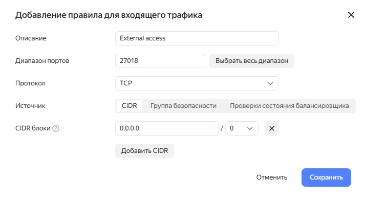

# Домашнее задание по лекции "Облака"

## Задание

Необходимо:
 - одну из облачных БД заполнить данными (любыми из предыдущих дз);
 - протестировать скорость запросов.

Задание повышенной сложности*
сравнить 2-3 облачных NoSQL по скорости загрузки данных и времени выполнения запросов.

## Выполнение задания

### Создание тестовых данных для загрузки в БД


### Создание БД в Yandex Cloud

1. Регистрируюсь в Yandex Cloud.

2. Создаю кластер MongoDB с внешним доступом:

<kbd></kbd>

<kbd></kbd>

<kbd></kbd>

<kbd></kbd>

<kbd></kbd>

3. Добавляю в профиль безопасности внешний доступ к БД по порту 27018:

<kbd></kbd>

<kbd></kbd>

<kbd></kbd>

4. Копирую SSL-сертификат:

```
mkdir -p ~/.mongodb
wget "https://storage.yandexcloud.net/cloud-certs/CA.pem" --output-document ~/.mongodb/root.crt
chmod 0644 ~/.mongodb/root.crt
```

5. Проверяю, что есть подключение к созданной БД с клиента на моём рабочем месте:

```
[root@host ~]# mongosh --norc --tls --tlsCAFile ~/.mongodb/root.crt --host 'rc1d-2rwigtopclqpgwnn.mdb.yandexcloud.net:27018' --username user1 --password '*****' db1
Current Mongosh Log ID: 67890ac1915396a22b544ca6
Connecting to:          mongodb://<credentials>@rc1d-2rwigtopclqpgwnn.mdb.yandexcloud.net:27018/db1?directConnection=true&tls=true&tlsCAFile=%2Froot%2F.mongodb%2Froot.crt&appName=mongosh+2.3.8
Using MongoDB:          7.0.5-mdb-c5ca57f0-sgn
Using Mongosh:          2.3.8

For mongosh info see: https://www.mongodb.com/docs/mongodb-shell/


To help improve our products, anonymous usage data is collected and sent to MongoDB periodically (https://www.mongodb.com/legal/privacy-policy).
You can opt-out by running the disableTelemetry() command.

------
   The server generated these startup warnings when booting
   2025-01-16T13:10:28.264+00:00: Using the XFS filesystem is strongly recommended with the WiredTiger storage engine. See http://dochub.mongodb.org/core/prodnotes-filesystem
------
```
